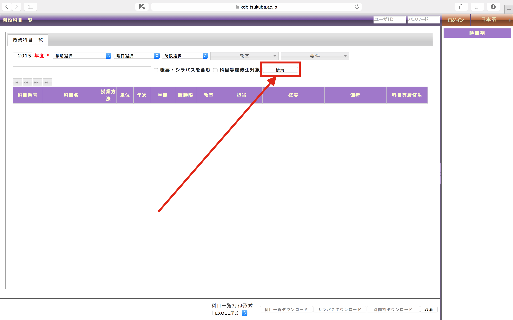
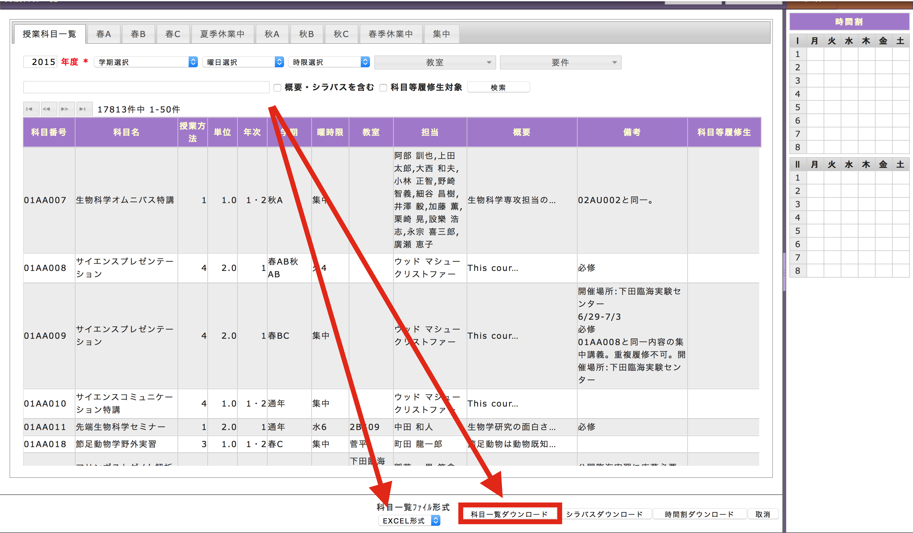

# Twintter

```
We got a second prize in our class !
```

Twintter is a system includes various function: searching, sharing, and talking about a course...

This application is for a main major training in University of Tsukuba, College of knowledge and library science.

## Environment

This app is running on ubuntu 14.05LST in production.

And we develop this app on MacOSX (10.9 and 10.10).

Ruby version: 2.1.4

Rails version: 4.1.2

## install

#### gem

please run to install required gems.

```shell
bundle install --path vendor/bundle
```

#### config/secrets.yml

create a secrets file.
```shell
cp config/secrets.yml.default config/secrets.yml
```

if you run this app with production mode, please run
```shell
bundle exec rake secret
```
and copy outputing String, paste into config/secrets.yml (http://stackoverflow.com/questions/21136363/using-config-secrets-yml-in-rails-4-0-2-version)

___don't make secret.yaml public !!!!___


#### create database
```shell
bundle exec rake db:migrate
```

#### model

make a model for polarity analysis.

```shell
bundle exec rake build
```

#### subjects data

___This column is under cunstruction.___

* download data





if exporting successes, you will get data into your download file (may be ~/Downloads).  

please puts the file in app/vendor/subjects  

file name may be 'kdb_xxxxxxxxx.xlsx'

(see https://github.com/makky3939/kdb2tsv , or https://github.com/himkt/kdb_scraper )

```shell
mkdir vendor/subject
cp path_to_kdbfile(kdb_xxxxxxxxx.xlsx) vendor/subject/
bundle exec ruby db/parse_xlsx.rb vendor/subject/kdb_xxxxxxxxx.xlsx
```

I have finished creating document about it.. I'm sorry but please wait...  

After all, please run

```shell
bundle exec rake db:seed
```

## run

```shell
rails s
```
